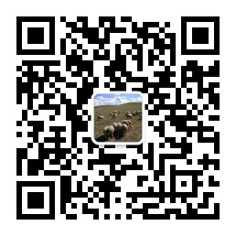

# K12 Teaching Animation

中小学教学动画可视化平台 - 让抽象的算法和化学反应变得生动易懂

## 📚 项目简介

本项目是一个专为K12教育设计的教学动画可视化平台，通过精美的动画演示帮助学生深入理解复杂的算法和化学反应过程。

## 🎯 包含内容

### 💻 信息技术 (40个动画)
- **排序算法**: 冒泡、选择、插入、希尔、快速、归并、堆排序等
- **树结构**: 二叉树遍历、AVL树、红黑树、堆等
- **图算法**: DFS、BFS、Dijkstra、Kruskal、拓扑排序等
- **数据结构**: 数组、链表、栈、队列、哈希表等
- **动态规划**: 01背包、最长公共子序列等
- **递归算法**: 汉诺塔、斐波那契、阶乘等

### 🧪 化学 (41个动画)
- **氧化还原反应**: 电子转移、金属反应等
- **金属反应**: 金属与酸、钠与水、镁条燃烧等
- **气体反应**: 氧气制取、二氧化碳制取、氢气燃烧等
- **酸碱盐反应**: 酸碱中和、复分解沉淀等
- **电化学**: 原电池、电解池、电解水等
- **有机化学**: 甲烷、苯、乙烯、酯化反应等
- **化学平衡**: 平衡移动、勒夏特列原理等
- **物质状态**: 三态变化、分子扩散等
- **原子结构**: 电子云、配位键等

### ⚛️ 物理 (50个动画)
- **力学**: 抛体运动、动量守恒、圆周运动、简谐振动、机械能守恒等
- **电磁学**: 串并联电路、电磁感应、洛伦兹力、带电粒子运动等
- **光学**: 光的干涉、衍射、折射、反射、透镜成像等
- **热学**: 热力学定律、分子运动论、气体变化过程等
- **原子物理**: α粒子散射、原子跃迁、衰变、核反应等

### 🧬 生物 (41个动画)
- **分子与细胞**: DNA复制、蛋白质合成、细胞分裂、细胞呼吸、光合作用等
- **遗传与变异**: 孟德尔遗传定律、减数分裂、伴性遗传、基因工程等
- **稳态与调节**: 神经调节、激素调节、免疫应答、内环境稳态等
- **生态与环境**: 生态系统物质循环、能量流动、种群增长等
- **生长与发育**: 胚胎发育、植物生长等

## 🌐 在线访问

本项目已部署到 GitHub Pages，可以通过以下链接访问：

- **主页**: `https://[你的用户名].github.io/K12-Teaching-Animation/`
- **信息技术**: `https://[你的用户名].github.io/K12-Teaching-Animation/信息技术/`
- **化学**: `https://[你的用户名].github.io/K12-Teaching-Animation/化学/`
- **物理**: `https://[你的用户名].github.io/K12-Teaching-Animation/物理/`
- **生物**: `https://[你的用户名].github.io/K12-Teaching-Animation/生物/`

## 📁 项目结构

```
K12-Teaching-Animation/
├── index.html                    # 主导航页面
├── 信息技术/
│   ├── index.html               # 信息技术导航页面
│   ├── 冒泡排序（...）/
│   │   ├── index.html
│   │   └── guide.md
│   └── ...
├── 化学/
│   ├── index.html               # 化学导航页面
│   ├── 氧化还原反应（...）/
│   │   ├── index.html
│   │   └── guide.md
│   └── ...
├── 物理/
│   ├── index.html               # 物理导航页面
│   ├── 抛体运动（...）/
│   │   ├── index.html
│   │   └── guide.md
│   └── ...
└── 生物/
    ├── index.html               # 生物导航页面
    ├── DNA复制（...）/
    │   ├── index.html
    │   └── guide.md
    └── ...
```

## ✨ 特色功能

- 🎨 **精美动画**: 现代化的视觉效果，让学习充满乐趣
- 🔬 **微观可视化**: 将抽象概念转化为直观动画
- 📱 **响应式设计**: 完美适配各种设备
- 🆓 **完全免费**: 所有内容开源免费
- 🎯 **分类清晰**: 科学的知识点分类
- ⚡ **快速加载**: 优化的性能体验

## 🚀 本地运行

1. 克隆项目到本地
```bash
git clone https://github.com/[你的用户名]/K12-Teaching-Animation.git
```

2. 使用任意HTTP服务器运行，例如：
```bash
# Python 3
python -m http.server 8000

# Node.js
npx http-server
```

3. 在浏览器中访问 `http://localhost:8000`

## 📝 使用说明

1. 打开主页，选择要学习的学科（信息技术或化学）
2. 在学科页面中，浏览各个分类的动画
3. 点击感兴趣的动画卡片，即可查看详细的动画演示
4. 每个动画都配有详细的说明文档（guide.md）

## 🤝 贡献

欢迎提交问题和建议！如果你有新的动画想法或改进建议，请：

1. Fork 本项目
2. 创建你的特性分支 (`git checkout -b feature/AmazingFeature`)
3. 提交你的更改 (`git commit -m 'Add some AmazingFeature'`)
4. 推送到分支 (`git push origin feature/AmazingFeature`)
5. 开启一个 Pull Request

## 📄 许可证

本项目采用 MIT 许可证 - 详见 LICENSE 文件

## 💬 联系方式

如有任何问题或建议，欢迎通过以下方式联系：

- GitHub Issues: [项目Issues页面]
- Email: [369660327@qq.com]



---

**让教育更生动，让学习更简单** ✨
